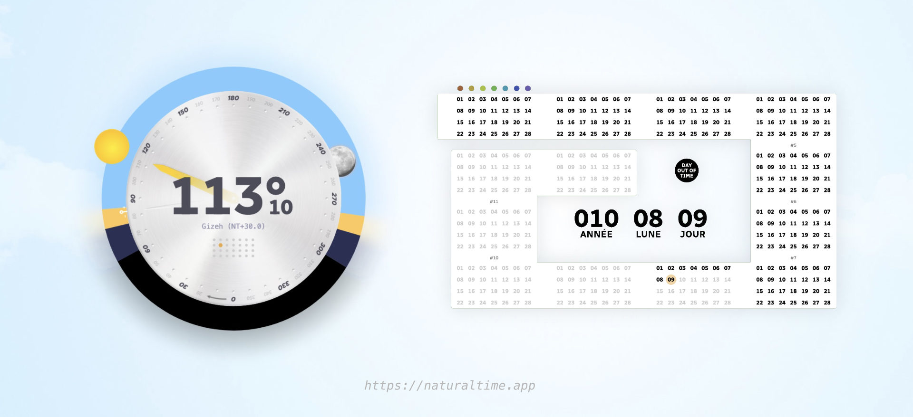

# Natural time

Natural time is a fresh, elegant, and coherent way of measuring the movements of time here on the Earth.

This **new time standard** is based on common sense and the observation of natural cycles.

This repository contains the current specifications of natural time in the English language. You may find the first implementation of it written in Javascript here : [github.com/sylvain441/natural-time-js](https://github.com/sylvain441/natural-time-js)

Play with natural time at [https://naturaltime.app/](https://naturaltime.app/)

# Specifications

Current version of natural time specifications : `v1.0`

## TIME 

### 360° clock

The natural time describes the position of the Sun in the sky as observed from a specific position on the Earth's surface (longitude).

`"What is the time at your place?"` is equivalent to: `"Where is the sun at your longitude?"`.

- A natural day starts at the very middle of the night (current longitude)
- A natural day ends at the next mid-night (same longitude)
- A full day reprents ths sun spining `360°` around the clock
- Mid-night: `0°`
- Mid-day: `180°`
- Northern hemisphere clock spins `clockwise`
- Southern hemisphere clock spins `anticlockwise`

### Time distance

There is no such concept as time zones with natural time. Time zones are replaced by time distances.

In natural time, space and time are expressed in the same unit. The _time distance_ is an expression that represent simultaneously:
- The longitudinal distance between two points (A and B) on Earth's surface
- The time it takes for the sun to move from point A to point B

For illustration purposes, this table displays the same time at different locations (longitudes).

|            | Point A    | NTZ        | POINT B    |
| ---------- | ---------- | ---------- | ---------- |
| LONGITUDE  | NT-30      | NT+0       | NT+40      |
| TIME       | 90°        | 120°       | 160°       |

The time distance between Point A and Point B is: `-30° + 40° = 70°`
`"NT"` stands for `Natural Time`.

### From artificial to natural time

Translating degrees from hours/minutes/seconds is quite straightforward. This table may give you some key insights to quickly do the math.

| Natural degrees | Artificial hours | Artificial minutes | Artificial seconds |
| --------------- | ---------------- | ------------------ | ------------------ |
| **360°**        | 24h              | -                  | -                  |
| **60°**         | 4h               | -                  | -                  |
| **30°**         | 2h               | -                  | -                  |
| **10°**         | -                | 40 min             | -                  |
| **5°**          | -                | 20 min             | -                  |
| **1°**          | -                | 4 min              | -                  |
| **0,1°**        | -                | -                  | 24s                |
| **0,01°**       | -                | -                  | 2,4s               | 

## DATE

### 13 Moons "calendar"

Many ancient civilisations already used the elegant 13-month 28-days calendar.

    1 moon = 28 days
    13 moons = 364 days

The current specification of natural time does not suggest any names for each of the 13 moons. It's up to any one/group/culture/language to add a layer of wording on top of universal numbers.

> The 28 days of each moon do not match precisely with the ~29.5 days of the astronomical new-moon/full-moon cycles

### Weeks

    1 week = 7 days
    4 weeks = 1 moon
    52 weeks = 13 moons = 364 days

The current specification of natural time suggests that week days may be named according to the 7 colors of the rainbow.

> Day 1: Red _#d74d40_  
> Day 2: Orange _#eaa945_  
> Day 3: Yellow _#dfdd45_  
> Day 4: Green _#7fc663_  
> Day 5: Blue _#49a2f0_  
> Day 6: Indigo _#443cea_  
> Day 7: Violet _#8047eb_  

### Years

    A year is either 365 or 366 days long

Calculating the position of the sun at both winter solstices is the only way to predict the year's duration (see below).

### Rainbow Day

    Rainbow days are the 365th (and the 366th if exists)

Rainbow days are considered "out of time". They do not belong to a specific moon or week. Those days are dedicated to the celebration of Life and Nature in all its forms.

### Line of date change

The antimeridian (+180°E) is the fixed virtual line marking the gap between two natural days globally. Exact mid-night at the antimeridian marks the openning of a new natural day.

### New year

Natural years beginning is calculated from the winter solstice in northern hemisphere.

Globally:

    GlobalYearStart at mid-night ('0°' or '00:00 UTC+12') at the antimeridian (+180°E) right after the northern winter solstice.

Locally:

    LocaYearStart the next local mid-night ('0°') after GlobalYearStart.

If the time distance between your position and the antimeridian is known, the formula is straightforward:

    LocaYearStart = GlobalYearStart + TimeDistanceFromAntimeridian

### Year 1

    Year 1 beginning : 1356091200000 (UNIX Timestamp)

Natural time adopted December 21st, 2012 as the beginning of Year 1. It is an arbitrary date. Any other random solstice would have also been a perfect choice, but this one simply carries an interesting symbolic package. Wrongly advertized as the "end of the world", 2012 is more like the beginning of a new cycle of 5125 years.    

    Year 1 : dec 2012 to dec 2013  
    UTC : 2012-12-21 at 12:00  
    UTC+12 (antimeridan) : 2012-12-22 at 00:00   
    ISO: 2012-12-21T12:00:00.000Z

### Year 0

For the sake of mathematical smoothness, year 0 exists.

    Year 0 : 2011/2012  
    Year -1 : 2010/2011 ...   

Here is the method to translate artifical year to natural year:

    Between january the 1st and LocalYearStart: 
    NaturalYear = GregorianYear - 2012

    Between LocalYearStart and december the 31st:
    NaturalYear = (GregorianYear + 1) - 2012

## FORMAT

Full ISO format :

    YYY)MM)DD SUN° NT(+/-)LONGITUDE
    ex: 010)05)22 202°63 NT+5.2

Date:

    YYY)MM)DD or YYY)RAINBOW(2)
    ex: 010)05)22 (year 10, 5th moon, 22nd day of the moon)

- Year `YYY` comes before the moon `MM` followed by the day `DD`. It ensures a coherent alphabetical/numeric order.
- Years are expressed with 3+ digits to create a visual difference with the actual 4 digits of artificial years.
- Moons are expressed with 2 digits from `01` to `13`
- Days are expressed with 2 digits from `01` to `28`
- YYY)MM)DD are separated by the `")"` sign
- Rainbow days do not belong to a specific moon: `YYY)RAINBOW` for day #365 or `YYY)RAINBOW+` for day #366 (when exists)

Time:

    SUN°DECIMALS
    ex: 202°63 (or 113°9, 257°, 55°123456789, ...)

- Time is expressed with 3 digits in `°` from `000°`to `359°`
- Decimals are written in base 10 with infinite precision allowed

Longitude:

    NT(+/-)LONGITUDE or NTZ
    ex: NT+5.2 (or NT-68, NT+52.441888, ...)

- `NT` stands for "Natural Time"
- `NTZ` equals `NT+0` (time at the meridian 0)
- Longitude is expressed with as many decimals as the precision requires

# Existing conventions adopted

## Base 10

With `base 10` being the most used and adopted convention on Earth right now, adopting the decimal system sounded like an obvious choice.

## 360° circle

A full circle can be graduated in an infinite number of ways. The widely adopted `360°` convention is used for many reasons:

- No learning curve: most of humanity pictures instantly the shape of 180°, 90°, 60° angles
- It matches the latitude/longitude system
- There are a lot of dividers: 180, 120, 90, 72, 60, 45, 40, 36, 30, 24, 20, 18, 15, 12, 10, 9, 8, 6, 5, 4, 3, 2, 1

## GPS latitude/longitude system

For navigation purposes, the Earth has been graduated with 360 meridians going from +180°E to -180°W. Meridian 0° is located on the North/South line crossing the Greenwich Observatory. 

We could have used another arbitrary place on Earth as the meridian of origin. However, using the Greenwich meridian allows smooth compatibility with the GPS system. Thus, we avoid unnecessary complexity or the need to print new maps.

## UTC & Mean Time

    Natural time utilize Mean Time (like UTC) to smoothen time variations

The Earth's rotation is not geometrically perfect, nor is its orbit around the Sun. Consequently, all days have different durations. UTC (Coordinated Universal Time) was designed to deal with this "problem" by calculating the mean time of all those variations. By using UTC, we don't reinvent the wheel. It also makes translations from artificial time much easier.

# Contribute

Natural time is open to contributions from free-thinking minds. Find your way through Github or email at: [sylvain441@proton.me](mailto:sylvain441@proton.me) to get in touch.

# License

Read [full license](./LICENSE) (Creative Common Zero)

Natural time is completely free to use, play, transform, improve... It operates under the law of Love. Follow your heart, fork it, spoon it! There is no need to ask for permission to do anything with it.

Natural time is supposed to bring joy and ease to human life, not the opposite. What you make out of it is up to you and the assistance of life forces.

# Acknowledgments

Natural time has been baking for a long time in a goat's mind while traveling around the world. Infinite gratitude to my beloved friends Uncle Skywalker and Ik: your precious insights into the Mayan universe were so inspiring.

It was a real pleasure to give birth of natural time during the spring/summer of 2022 in the peaceful French alps.

🌍 One love 🌎

🏔 🐐 🌞 🌈